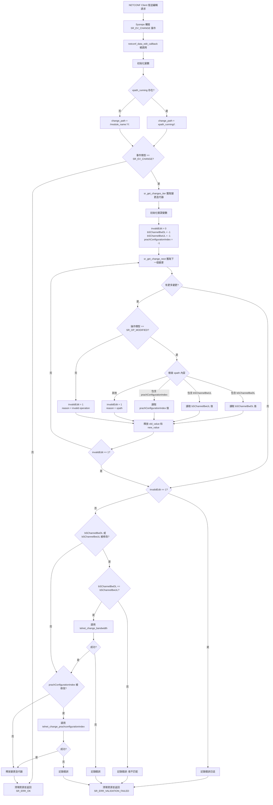

# netconf_data_edit_callback 流程圖

## 整體架構

```
NETCONF Client (外部管理系統)
         |
         | NETCONF Edit Request
         ↓
    Sysrepo (數據存儲)
         |
         | Change Event (SR_EV_CHANGE)
         ↓
netconf_data_edit_callback
         |
         | Telnet Command
         ↓
    Telnet Server (OAI gNB)
         |
         ↓
    gNB L1 層配置更新
```

## 詳細流程

### 1. 註冊階段 (netconf_data_register_callbacks)

```
開始
  |
  ├─ 檢查 MANAGED_ELEMENT_XPATH 是否為空
  |   └─ 如果為空 → 錯誤退出
  |
  ├─ 檢查是否已經訂閱
  |   └─ 如果已訂閱 → 錯誤退出
  |
  ├─ 調用 sr_module_change_subscribe()
  |   ├─ 模組: "_3gpp-common-managed-element"
  |   ├─ XPath: MANAGED_ELEMENT_XPATH
  |   ├─ 回調函數: netconf_data_edit_callback
  |   └─ 訂閱句柄: netconf_data_subscription
  |
  └─ 返回成功
```

### 2. 回調觸發階段 (netconf_data_edit_callback)



### 3. Telnet 命令執行階段

#### 3.1 telnet_change_bandwidth 流程

```
telnet_change_bandwidth(new_bandwidth)
  |
  ├─ telnet_lock() - 鎖定 telnet 連接
  |
  ├─ 步驟 1: 停止 modem
  |   ├─ 發送: "o1 stop_modem\n"
  |   ├─ 等待提示符: "softmodem_gnb> "
  |   ├─ 檢查回應是否包含 "FAIL"
  |   └─ sleep(1)
  |
  ├─ 步驟 2: 設定新的帶寬
  |   ├─ 發送: "o1 bwconfig <new_bandwidth>\n"
  |   ├─ 等待提示符: "softmodem_gnb> "
  |   ├─ 檢查回應是否包含 "FAIL"
  |   └─ sleep(1)
  |
  ├─ 步驟 3: 重啟 modem
  |   ├─ 發送: "o1 start_modem\n"
  |   ├─ 等待提示符: "softmodem_gnb> "
  |   └─ 檢查回應是否包含 "FAIL"
  |
  ├─ telnet_unlock() - 解鎖 telnet 連接
  |
  └─ 返回成功/失敗
```

#### 3.2 telnet_change_prachconfigurationindex 流程

```
telnet_change_prachconfigurationindex(new_prachconfig)
  |
  ├─ telnet_lock() - 鎖定 telnet 連接
  |
  ├─ 步驟 1: 停止 modem
  |   ├─ 發送: "o1 stop_modem\n"
  |   ├─ 等待提示符: "softmodem_gnb> "
  |   ├─ 檢查回應是否包含 "FAIL"
  |   └─ sleep(1)
  |
  ├─ 步驟 2: 設定新的 PRACH configuration index
  |   ├─ 發送: "o1 prachconfig <new_prachconfig>\n"
  |   ├─ 等待提示符: "softmodem_gnb> "
  |   ├─ 檢查回應是否包含 "FAIL"
  |   └─ sleep(1)
  |
  ├─ 步驟 3: 重啟 modem
  |   ├─ 發送: "o1 start_modem\n"
  |   ├─ 等待提示符: "softmodem_gnb> "
  |   └─ 檢查回應是否包含 "FAIL"
  |
  ├─ telnet_unlock() - 解鎖 telnet 連接
  |
  └─ 返回成功/失敗
```

## 支持的 XPath 參數

當前實現支持以下參數的動態修改：

1. **bSChannelBwDL** - 下行鏈路帶寬 (Downlink Bandwidth)
2. **bSChannelBwUL** - 上行鏈路帶寬 (Uplink Bandwidth)
3. **prachConfigurationIndex** - PRACH 配置索引

## 驗證規則

### 帶寬修改驗證
- 僅允許 `SR_OP_MODIFIED` 操作
- `bSChannelBwDL` 和 `bSChannelBwUL` 必須相等
- 如果驗證失敗，返回 `SR_ERR_VALIDATION_FAILED`

### PRACH 配置索引驗證
- 僅允許 `SR_OP_MODIFIED` 操作
- 獨立於帶寬修改進行處理

## 錯誤處理

### 可能的錯誤返回值

1. **SR_ERR_OK** - 成功
2. **SR_ERR_INTERNAL** - 內部錯誤
   - `sr_get_changes_iter()` 失敗
   - 其他系統錯誤
3. **SR_ERR_VALIDATION_FAILED** - 驗證失敗
   - 不支持的操作類型（非 MODIFY）
   - 不支持的 XPath
   - bSChannelBwDL != bSChannelBwUL
   - Telnet 命令執行失敗

## 完整調用鏈

```
外部 NETCONF 客戶端
    ↓
NETCONF 協議層
    ↓
Sysrepo 數據存儲
    ↓
sr_module_change_subscribe (註冊時)
    ↓
netconf_data_edit_callback (配置變更時)
    ↓
telnet_change_bandwidth / telnet_change_prachconfigurationindex
    ↓
telnet_write (發送命令)
    ↓
telnet_sendPipe (管道通信)
    ↓
telnet_thread_routine (Telnet 線程)
    ↓
libtelnet
    ↓
TCP Socket
    ↓
gNB Telnet Server (127.0.0.1:9090)
    ↓
O1 命令處理器
    ↓
gNB L1 層配置更新
```

## 時序圖

```
NETCONF     Sysrepo    Callback    Telnet     gNB
Client                  Handler    Client
  |           |           |          |         |
  |--編輯請求->|           |          |         |
  |           |--觸發----->|          |         |
  |           |  事件      |          |         |
  |           |           |--鎖定---->|         |
  |           |           |          |         |
  |           |           |--stop--->|-------->|
  |           |           |  modem   |         |
  |           |           |          |<--------|
  |           |           |          | 確認    |
  |           |           |<---------|         |
  |           |           |  sleep(1)|         |
  |           |           |          |         |
  |           |           |--配置---->|-------->|
  |           |           |  命令    |         |
  |           |           |          |<--------|
  |           |           |          | 確認    |
  |           |           |<---------|         |
  |           |           |  sleep(1)|         |
  |           |           |          |         |
  |           |           |--start-->|-------->|
  |           |           |  modem   |         |
  |           |           |          |<--------|
  |           |           |          | 確認    |
  |           |           |<---------|         |
  |           |           |          |         |
  |           |           |--解鎖--->|         |
  |           |<--返回----|          |         |
  |           |   成功    |          |         |
  |<--確認----|           |          |         |
  |           |           |          |         |
```

## 注意事項

1. **線程安全**: 使用 `telnet_lock()` 和 `telnet_unlock()` 確保同時只有一個配置變更在進行
2. **同步延遲**: 在停止和重啟 modem 之間有 1 秒的延遲，確保配置正確應用
3. **錯誤恢復**: 如果任何步驟失敗，會自動清理資源並返回錯誤
4. **驗證機制**: 在實際應用配置前進行嚴格的參數驗證

## 擴展方式

如果要添加新的可配置參數：

1. 在 `netconf_data_edit_callback` 中添加新的變數（如 `int new_parameter = -1;`）
2. 在 `while` 循環中添加 XPath 檢測（如 `else if(strstr(new_value->xpath, "newParameter"))`）
3. 在驗證後添加相應的處理邏輯和 telnet 函數調用
4. 在 `telnet.c` 中實現對應的 telnet 函數
5. 在 `telnet.h` 中添加函數聲明
